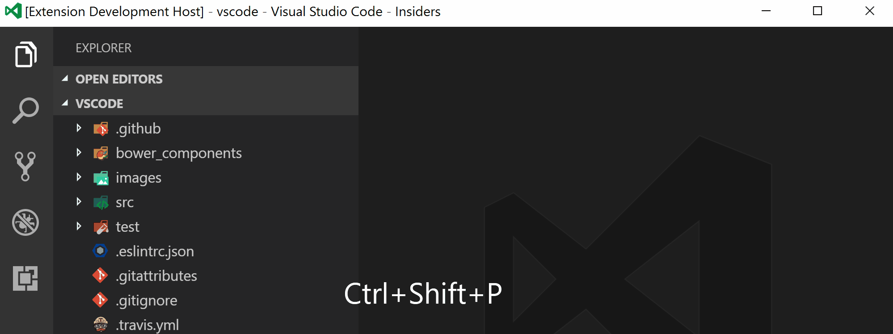
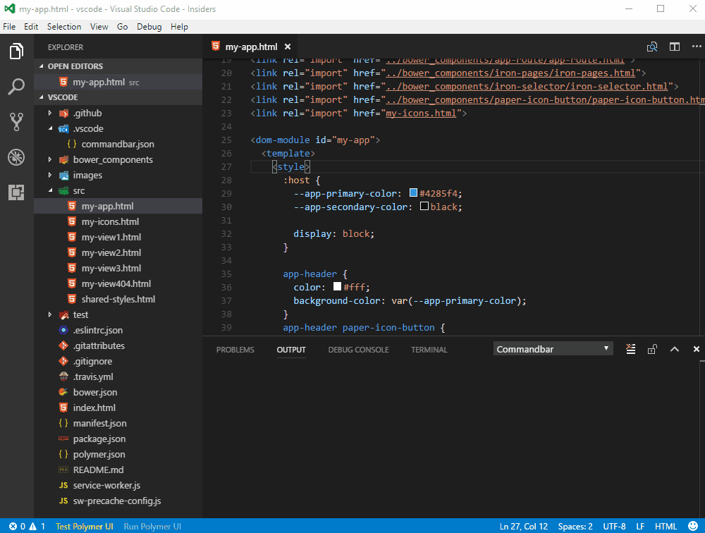

# Visual Studio Code Command bar

A Command bar within VSCode Status bar.

## Get Started

[](getstarted.gif)

## Features

* Execute command:
	- Long-running command termination
	- 3 types of commands:
		* `exec`: executes command e.g `npm run serve` (default)
		* `script`: executes package.json script
		* `palette`: executes any [vscode command](https://code.visualstudio.com/docs/getstarted/keybindings#_default-keyboard-shortcuts) or any extension command
			- comma-separated list of commands that get executed sequentially
			- command support arguments separated by pipe (e.g. `workbench.action.tasks.runTask|My Task`)
		* `file`: opens a file(s) or an url(s) in a browser
			- comma-separated list of files that is shown as a dropdown
			- support label followed by pipe (e.g. `https://somesite.com|My Site`)
* Configurable Status bar item properties (including text, tooltip, alignment, color, priority, language filter)
* Create workspace and global settings file (`Ctrl+Shift+P` or `Cmd+Shift+P` type `Commandbar: Settings`)
	- Apply settings immediately after saving changes in `./.vscode/commandbar.json` file
	- Support comments in JSON as an extension to JSON specification

[](demo.gif)

## Settings Reference

General options
* **skipTerminateQuickPick** Do not show Terminate QuickPick.
	> Terminates running command by default
* **skipSwitchToOutput** Do not switch to Output.
* **skipErrorMessage** Do not popup Error message.
* **commands** List of commands.

Command options
* **text** Displayed text of status bar item.
	> Supports unicode "icon" that can be found [here](https://unicode-table.com/).
	> Supports icons from [here](https://octicons.github.com/) e.g. `$(mark-github) Go To GitHub`
* **command** Command content according to commandType:
	- 'exec': executes command e.g 'npm run serve' (default).
	- 'script': executes package.json script.
	- 'palette': executes any [vscode command](https://code.visualstudio.com/docs/getstarted/keybindings#_default-keyboard-shortcuts) or any extension command
		* comma-separated list of commands that get executed sequentially
		* command support arguments separated by pipe (e.g. `workbench.action.tasks.runTask|My Task`)
	- 'file': opens a file or an url (comma-separated list)
		* comma-separated list of files that is shown as a dropdown
		* support label followed by pipe (e.g. `https://somesite.com|My Site`)
* **alignment** Alignment of status bar item.
* **tooltip** Tooltip of status bar item.
* **color** Text color of status bar item.
* **language** Language filter of status bar item.
* **priority** Priority (placement) of status bar item.
* **commandType** Type of command.
	- 'exec': executes command e.g 'npm run serve' (default).
	- 'script': executes package.json script.
	- 'palette': executes any [vscode command](https://code.visualstudio.com/docs/getstarted/keybindings#_default-keyboard-shortcuts) or any extension command (comma-separated list of commands that get executed sequentially)
	- 'file': opens a file or an url (comma-separated list)
* **skipTerminateQuickPick** overwrite general `skipTerminateQuickPick` option.
* **skipSwitchToOutput** overwrite general `skipSwitchToOutput` option.
* **skipErrorMessage** overwrite general `skipErrorMessage` option.

## Config file example (`./.vscode/commandbar.json` or `~/commandbar.json`)

```json
{
	"skipTerminateQuickPick": true,
	"skipSwitchToOutput": false,
	"skipErrorMessage": true,
	"commands": [
		{
			"text": "Serve Polymer UI",
			"tooltip": "Serve Polymer UI",
			"color": "yellow",
			"commandType": "exec",
			"command": "polymer serve",
			"alignment": "left",
			"skipTerminateQuickPick": false,
			"priority": 1
		},
		{
			"text": "$(octicon-bug) Test Polymer UI",
			"color": "lightgreen",
			"commandType": "script",
			"command": "test",
			"priority": 2
		},
		{
			"text": "☯",
			"tooltip": "ESLint: Fix All",
			"color": "orange",
			"commandType": "palette",
			"command": "eslint.executeAutofix",
			"alignment": "right",
			"priority": 3
		}
	]
}
```

## Change Log

[Change Log](CHANGELOG.md)

## License

[MIT](LICENSE.md)
